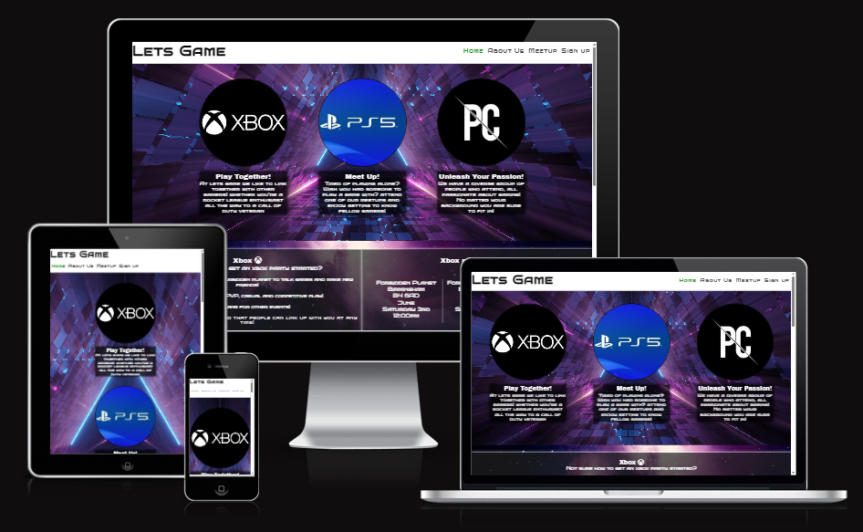
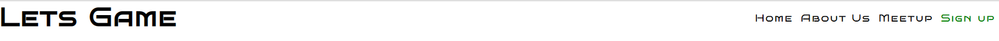
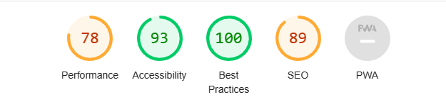

# LETS GAME

The purpose of Lets Game is to get people who love gaming to come together to make new friends.
Its intended audience are people who do not currently have people to play games with or are looking to branch out, they can do this by simply seeing when
and where there is a meetup.

see the live version [here](https://liamedwards931.github.io/Project1-LetsGame/)

## Features

### Existing Features

- **Navigation Bar**

   - The navigation bar is consistent across both pages, has responsive styling and highlights when you are on your current page
the navigation bar has 4 links: home, about us, meetup and sign up, Allowing for easy navigation of the website.

   - there is no need to use the back button across all of the devices as the links take you to and from the different sections.

- **Index Page about us**
    - The about us section appears immediately and has strong visuals on the three main platforms to immediately give the viewer a context of the page.
    each of the logos has a small eyecatching heading to give a description on the intended purpose of the page.

- **meetup times section**
    - The meet-up section is broken up into 3 different parts: Xbox, Playstation and PC - this is so it's very clear which meetup you should attend
    based on the type of platform you play.
    - The section gives you a welcome to each platform and some suggestions to prepare for the meetup such as having your network ID handy so you can continue to meet up after the event is over.

- **footer**
    - The footer is fixed to the bottom of the screen and has a contrast to the rest of the site for importance.
    - it has 3 sections of navigation: Social media, Gaming platforms, Social gaming platforms. The social media is for the Lets Game updates and to keep in touch with other gamers. The Gaming platforms is so if the user doesn't have know their gaming ID they can access it through the link and finally the social gaming - this has discord for PC players, twitch and youtube so you can view each others channels if they have one.

-**sign up page**
    - This page will allow the user to sign up with the lets game community. The sign page has a form that requires the user to enter their first and last names, email address and the type of platform they are playing on.

### Future Features

- The website will have a running server that will take the user to a chatboard after they have signed up. 

## Testing

-**HTML**
    - No errors returned when passing through [W3C Validator](https://validator.w3.org/nu/?doc=https%3A%2F%2Fliamedwards931.github.io%2FProject1-LetsGame%2F)

- **CSS**
  - No errors returned when passing through [jigsaw validator](https://jigsaw.w3.org/css-validator/validator?uri=https%3A%2F%2Fliamedwards931.github.io%2FProject1-LetsGame%2F&profile=css3svg&usermedium=all&warning=1&vextwarning=&lang=en)

- **Feature testing**
- Tested all links - working as intended, all external links open in new tab with relevant aria-labels.
- Media queries tested as thoroughly as I could, no errors from what I have tested.
- Webpage is responsive to a minimum width of 320px
- Devtool tested the webpage using different screen sizes and no errors from what I have tested.
- Index page lines vertically when screen size changes allowing clear information.
- No pixelation in images used.

- **lighthouse score**

- lower score on performance due to the file size of the background images.

