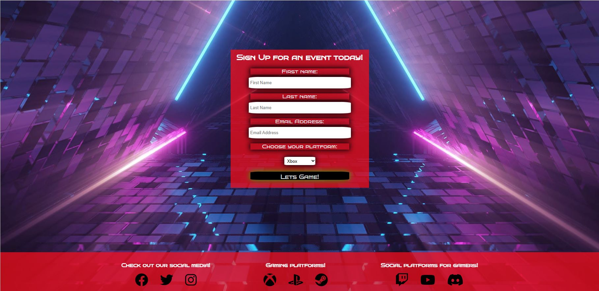

# LETS GAME

The purpose of Lets Game is to get people who love gaming to come together to make new friends.
Its intended audience are people who do not currently have people to play games with or are looking to branch out, they can do this by simply seeing when
and where there is a meetup.

see the live version [here](https://liamedwards931.github.io/Project1-LetsGame/)

## Contents

- [LETS GAME](#lets-game)
  - [Contents](#contents)
  - [User Experience](#user-experience)
  - [Inspiration](#inspiration)
  - [Site structure](#site-structure)
  - [Design choices](#design-choices)
  - [Features](#features)
    - [Existing Features](#existing-features)
    - [Future Features](#future-features)
  - [Technologies used](#technologies-used)
  - [Testing](#testing)
  - [BUGS](#bugs)
    - [Index Page](#index-page)
    - [Signup Page](#signup-page)
  - [Deployment](#deployment)
  - [Cloning repository](#cloning-repository)
  - [Credits](#credits)
  - [Acknowledgements](#acknowledgements)

## User Experience

- ### User Stories

- Lets Game should be easy to understand.
- Lets Game should have a style that is relevant to the subject.
- As a user I would expect to have relevant information to be able to understand the purpose.
- As a user I would expect to see images that are related to the subject matter. 
- As a user I would expect to see information about how many people will be in attendance. 
- As a user I would expect to be able to meet up with other gamers based on the platform I play. 
- As a user I would expect to be able to connect with live updates through social media. 
- As a user I would expect to be able to view other peoples gaming channels.
  
[home](<lets game>)

## Inspiration

- Lets Game started by sketching a design in a notebook and mindmapping the ideas I had for the initial prototype.
- I then used Visual Studio desktop version to layout a rough idea of the styles I was looking for in the project, I experimented with different box-shadows, contrasting colors and which logos I would like to use and what opacity the background of the divs should be to create a website that is both easy to read and good to look at.
 
 [home](<lets game>) 

## Site structure

- The header nav bar is fixed to the top of the page so no matter where you scroll you can always navigate to the page or section you want.
- The home page is the primary page and the link to it is the top of the page function in the navigation bar this is accessible at all times.
- The meet-up button is also available at any point and this will take you to the meet up times section of the page.
- The sign-up button is available at all times and will take you the sign-up page section which will give some more insight into the Lets Game Meetups.

 ## Design choices

- **Font style**
  - The two styles chosen were Bruno Ace SC & Archivo Black.
    - 'Bruno Ace' was chosen as the main body font this was due to it's digital feel, this would appeal to the gaming communitity and pursue them to read into the content and explore the site in more dppth. 
    - 'Archivo Black' was chosen as the heading font this was due to it's easy to read feel and good contrast from the digital style of the 'Bruno' font.
  
- **Color Scheme**
  - The main colors used in Lets Game are black and white with background images on the body and the about-us section. 
    -The reason these two colors were chosen was because of the high contrast between the two colors and how it flowed with the background image used on the body, to give the entire page a nice sci-fi feel to it. 
    - The background image used in the about-us section and the sign up body was chosen due to it's great contrast to the body image, the style of the image always lures you in to draw your attention to the sign up form.

[home](<lets game>)

## Features

### Existing Features

- **Navigation Bar**

  - The navigation bar is consistent across both pages, has responsive styling and highlights when you are on your current page
the navigation bar has 4 links: home, about us, meetup and sign up, Allowing for easy navigation of the website.

  - There is no need to use the back button across all of the devices as the links take you to and from the different sections.

- **Index Page about us**
  - The about us section appears immediately and has strong visuals on the three main platforms to immediately give the viewer a context of the page.
    each of the logos has a small eyecatching heading to give a description on the intended purpose of the page.

- **Meetup times section**
  - The meet-up section is broken up into 3 different parts: Xbox, Playstation and PC - this is so it's very clear which meetup you should attend
    based on the type of platform you play.
  - The section gives you a welcome to each platform and some suggestions to prepare for the meetup such as having your network ID handy so you can continue to meet up after the event is over.

- **Footer**
  - The footer is fixed to the bottom of the screen and has a contrast to the rest of the site for importance.
  - it has 3 sections of navigation: Social media, Gaming platforms, Social gaming platforms. The social media is for the Lets Game updates and to keep in touch with other gamers. The Gaming platforms is so if the user doesn't have know their gaming ID they can access it through the link and finally the social gaming - this has discord for PC players, twitch and youtube so you can view each others channels if they have one.

- **Sign up page**
  - This page will allow the user to sign up with the lets game community. The sign page has a form that requires the user to enter their first and last names, email address and the type of platform they are playing on.
  - The sign up form has "required" values set to it so users have to enter there credentials before they can submit the form.

[home](<lets game>)

### Future Features

- The website will have a running server that will take the user to a chatboard after they have signed up.
  
  [home](<#lets-game>)

## Technologies used 

- This webpage was created using:
  - [HTML5](https://html.spec.whatwg.org/)
  - [CSS](https://www.w3.org/Style/CSS/Overview.en.html)
  - [CodeAnywhere](https://codeanywhere.com/signin)
  - [GitHub](https://github.com/)

[home](<lets game>)
    
## Testing

- **HTML**
  - No errors returned when passing through [W3C Validator](https://validator.w3.org/nu/?doc=https%3A%2F%2Fliamedwards931.github.io%2FProject1-LetsGame%2F)

- **CSS**
  - No errors returned when passing through [jigsaw validator](https://jigsaw.w3.org/css-validator/validator?uri=https%3A%2F%2Fliamedwards931.github.io%2FProject1-LetsGame%2F&profile=css3svg&usermedium=all&warning=1&vextwarning=&lang=en)

- **Feature testing**
  - Tested all links - working as intended, all external links open in new tab with relevant aria-labels.
  - Media queries tested as thoroughly as I could, no errors from what I have tested.
  - Webpage is responsive to a minimum width of 320px
  - Devtool tested the webpage using different screen sizes and no errors from what I have tested.
  - Index page lines vertically when screen size changes allowing clear information.
  - No pixelation in images used.
  - Tested on browsers:
    - [Microsoft Edge](https://www.microsoft.com/en-us/edge?form=MA13FJ&exp=e00)
    - [Google Chrome](https://www.google.com/chrome/)
    - [FireFox](https://www.mozilla.org/en-GB/firefox/new/?utm_medium=paidsearch&utm_source=google-rsa&utm_campaign=fxeu&utm_content=A144_A203_302582&gclid=CjwKCAjw67ajBhAVEiwA2g_jECRPdogz3fnztw2XKZjIiZ9baxIdSChKdQAKiUuOZn-c_aDezOeEixoCfqQQAvD_BwE)

[home](<lets game>)

## BUGS

### Index Page

- Fixed bugs
  - Navigation bar wouldn't respond when screen size changed.
  - Circle divs in about us section were too far to the left when screen size decreased.
  - Footer disappeared when content pushed it down on index page.
  - Meet up section overlapped when screen size decreased.
  - Links wouldn't connect to the section ID's
  - About-us section kept overlapping the meetup section
  
### Signup Page

- Fixed Bugs
  - Header pushed to the left when screen size decreased.
  - Form on submit sent you to a new page with a 404 error.
  - Form submit button was smaller than the text content.
  - Footer wouldn't stick to the bottom of the page.
  - Footer stuck half way up the page when screen size decreased.
  - Footer overlapped the sign up form when screen height decreased.
  - Labels on form didn't show up above the form input.

I had identified these bugs through testing the media queries on the devtools toolbar, and also running the code through the validator tools.

[home](<lets game>)
  
- **Unfixed Bugs**
  - Tested the website to the best of my ability and couldn't see any apparent bugs that needed fixing.

- **lighthouse score**

- lower score on performance due to the file size of the background images.
- Accesibility score is high due to the contrast of colors and the backgrounds set on containers to ensure good visibility for all content.

[home](<lets game>)
  
## Deployment

- This site was deployed through Github pages the steps to do so are as follows:
  1. Go to repository of the website you are working on.
  2. Go to the settings option.
  3. Scroll down to the pages section on the left hand side.
  4. Select the main branch to deploy.
  5. Github will give you the live link for your webpage.
  - The live site can also be reached here: [Lets Game](https://liamedwards931.github.io/Project1-LetsGame/)
  - The repository for this site can be reached here: [Lets Game Repository](https://github.com/LiamEdwards931/Project1-LetsGame)

[home](<lets game>)

 ## Cloning repository
 
1. On your GitHub repository navigate to your repository page.
2. Click on the green button with "CODE" written in it.
3. Go to the HTTPS and copy the URL by pressing the overlapping squares.
4. Open Git Bash.
5. Enter  git clone followed by the copied URL. 
6. Enter where you would like your repository to be saved too for your local file.
7. Press Enter to finalise the clone.

[home](<lets game>)

## Credits

- **Content**
  - The icons used in the Footer and the Meetup section are taken from [Font Awesome](https://fontawesome.com/kits)
  - Took guidance for box shadow CSS styling from [W3 Schools](https://www.w3schools.com/)

- **Media**
  - The background image used for the body on the index page is supplied by [Pixabay](https://pixabay.com/)
  - The background image used in the about-us section was taken from[FreePik](https://www.freepik.com/free-photo/cool-geometric-triangular-figure-neon-laser-light-great-backgrounds_9970519.htm#query=background%20gaming&position=2&from_view=search&track=ais)
  - The Xbox logo in the about-us section was taken from [Vecteezy](https://www.vecteezy.com)
  - The Playstation logo in the about us section was taken from [Pintrest](https://www.pinterest.co.uk/pin/598204763023781305/)
  - The PC logo in the about us section was taken from [Vecteezy](https://www.vecteezy.com/free-vector/pc-logo)

[home](<lets game>)
  
  ## Acknowledgements
  
  - Lets Game is a fictional company but is inspired by my own and other peoples experiences when you are a but prohibited from playing with other people because you don't have the same console or you don't enjoy the same games. 
  - This project was created for the level 3 diploma Full Stack Developer with the [Code Institute](https://codeinstitute.net/full-stack-software-development-diploma/?utm_term=code%20institute&utm_campaign=CI+-+UK+-+Search+-+Brand&utm_source=adwords&utm_medium=ppc&hsa_acc=8983321581&hsa_cam=1578649861&hsa_grp=62188641240&hsa_ad=635720257674&hsa_src=g&hsa_tgt=kwd-319867646331&hsa_kw=code%20institute&hsa_mt=e&hsa_net=adwords&hsa_ver=3&gad=1&gclid=CjwKCAjw67ajBhAVEiwA2g_jEKYbx7CDH4ExZGh3udf-5qh-Ee91R2MXr7F5M4UdbdDhV-c-QZ-_zxoCyW4QAvD_BwE)
  - [Precious Ijege](https://www.linkedin.com/in/precious-ijege-908a00168/) for the constructive feedback with my milestone project.

Liam Edwards 2023.

[home](<lets game>)
